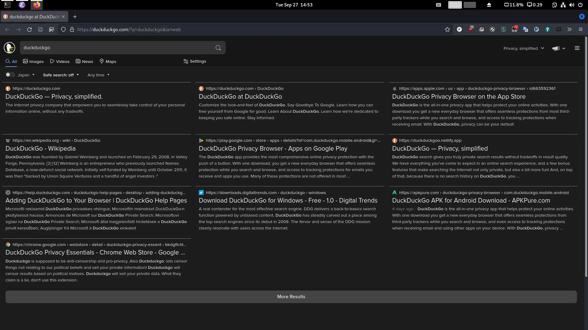

# Multicol DuckDuckGo
**2022-09-30:** I rewrote this using css only.
Please see [sumadoratyper/userstyles: My userstyles](https://github.com/sumadoratyper/userstyles)

A Greasemonkey script to display DuckDuckGo in multi-columns.

## Screenshot

## Installation
You can install it from Greasy Fork:
[Multicol DuckDuckGo](https://greasyfork.org/ja/scripts/452088-multicol-duckduckgo)
